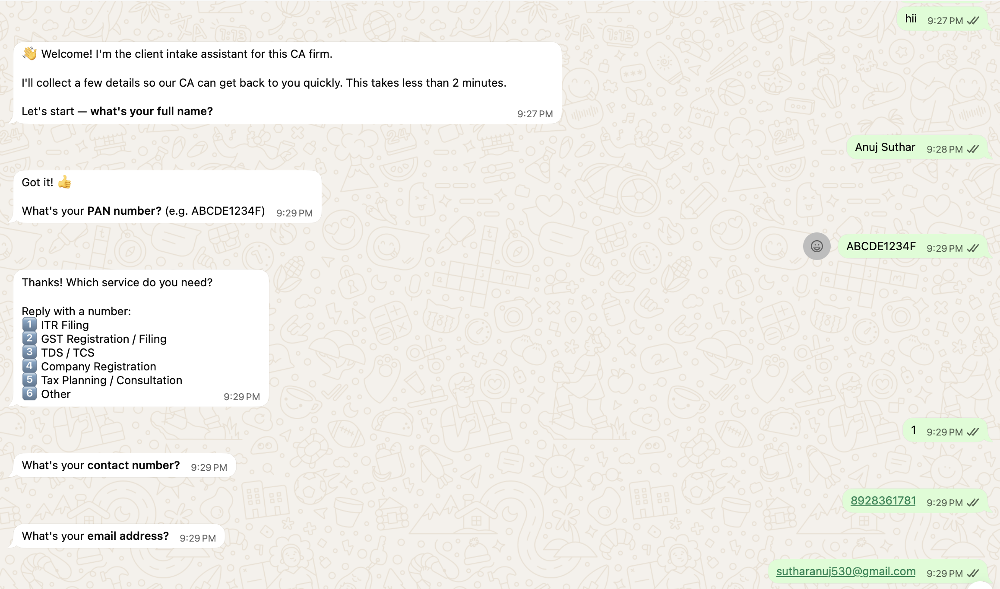
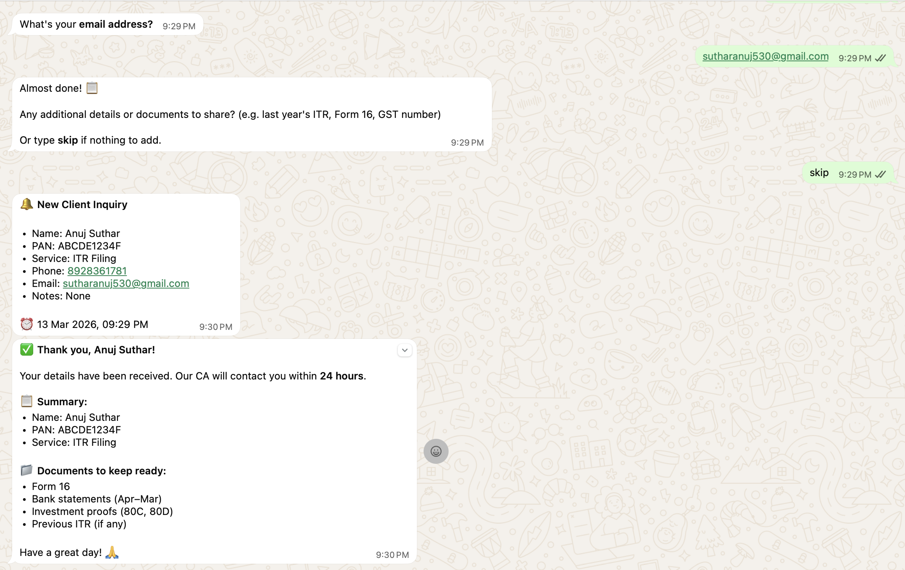
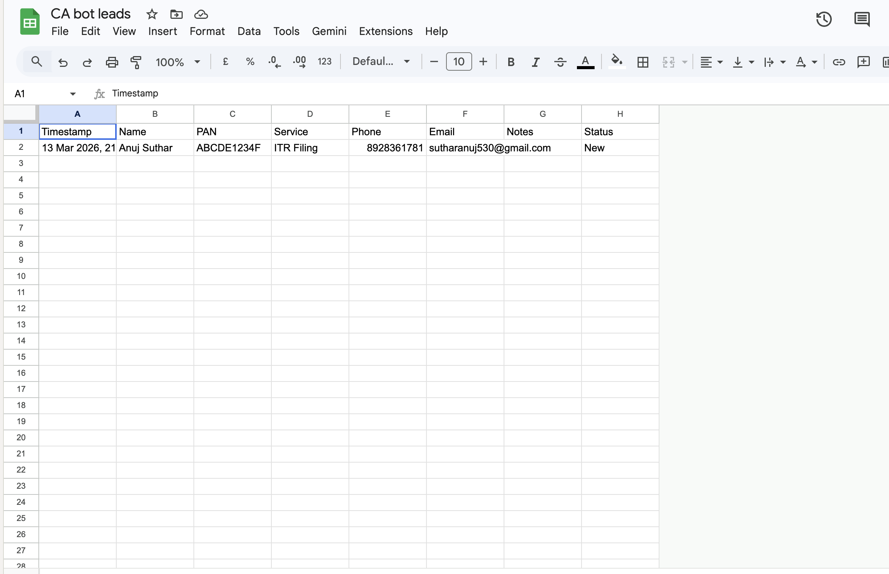

# Google Maps Lead Gen System

A complete lead generation pipeline that scrapes Google Maps, enriches leads with contact emails, and syncs everything to Google Sheets — ready for outreach.

Built for freelancers, agencies, and sales teams who need quality local business leads fast.

---

## What it does

1. **Scrapes Google Maps** — searches any business category in any city/area, extracts business name, phone, website, address, rating
2. **Enriches with emails** — visits each website and finds contact emails automatically (10 threads in parallel)
3. **Emails leads** — sends personalised, automated cold emails via Gmail SMTP with attachments
4. **Syncs to Google Sheets** — pushes all leads to a tracker sheet with outreach status columns, deduplicates on re-runs
5. **Keeps one canonical CSV** — every pipeline step updates `data/leads.csv` instead of creating separate raw/enriched files

---

## Demo


*Automated WhatsApp intake flow*


*Instant alert sent to your phone*


*Automated lead tracking in Google Sheets*

```
Lead Gen Scraper
Areas: 4  |  Categories: 3  |  Max per search: 20

── Andheri West ──────────────────────────────────────
  → CA firm in Andheri West Mumbai
  Found 20 listings
  ✓ A. M. Jain & Company             022 2636 1428
  ✓ Engineer & Mehta, CA             022 4602 6909
  ✓ AFS and Company                  098927 89813
  Saved 18 leads (total: 18)

Email Enricher — 10 threads
  ✓ A. M. Jain & Company             info@amjain.com
  ✓ Engineer & Mehta, CA             info@enmglobal.com

Google Sheets Sync
  ✓ Added 18 new leads
```

---

## Tech stack

- **Python 3.11+**
- **Playwright** — browser automation for Google Maps
- **BeautifulSoup4** — email extraction from websites
- **gspread + google-auth** — Google Sheets API
- **concurrent.futures** — parallel email enrichment
- **rich** — terminal output

---

## Quick start

### 1. Clone and install

```bash
git clone https://github.com/yourusername/leadgen
cd leadgen
python3 -m venv venv
source venv/bin/activate        # Windows: venv\Scripts\activate
pip install -r requirements.txt
playwright install chromium
```

### 2. Set up Google Sheets API

1. Go to [console.cloud.google.com](https://console.cloud.google.com) → New project
2. Enable **Google Sheets API** and **Google Drive API**
3. Go to **Credentials** → **Create Credentials** → **Service Account**
4. Under the service account → **Keys** → **Add Key** → JSON → download
5. Rename the downloaded file to `credentials.json` and place it in the project folder
6. Create a Google Sheet → **Share** it with the `client_email` from `credentials.json` (Editor access)
7. Copy the Sheet ID from the URL: `docs.google.com/spreadsheets/d/`**THIS_PART**`/edit`

### 3. Configure

Create a `.env` file:

```
GOOGLE_SHEET_ID=your_sheet_id_here
GOOGLE_CREDENTIALS_PATH=credentials.json
```

Edit `config.py` to set your target areas and categories:

```python
AREAS = [
    "Koramangala", "Indiranagar", "Whitefield",  # Bangalore example
    # add as many areas as you want
]

CATEGORIES = {
    "Restaurant":    ("restaurant",    "Web Dev"),
    "Gym":           ("gym",           "Both"),
    "Dental Clinic": ("dental clinic", "Automation"),
    # format: "Display Name": ("search keyword", "your service tag")
}
```

### 4. Run

```bash
# Test — one area, one category, no sheets sync
python main.py --areas "Koramangala" --categories "Restaurant" --no-sheets

# Full pipeline (Scrape + Enrich + Sync)
python main.py

# Send cold emails
python emailer.py

# Send to specific category with a limit
python emailer.py --category "CA Firm" --limit 20
```

---

## Output

### CSV files

| File | Contents |
|---|---|
| `data/leads.csv` | Canonical lead file — scraped fields, email enrichment, score, outreach status, follow-up metadata |
| `data/archive/*.csv` | Legacy CSVs are moved here automatically on first run so the active workspace only uses one live CSV |

### Google Sheet columns

| Column | Filled by |
|---|---|
| Business Name | Scraper |
| Category | Scraper |
| Service | Scraper (from your config) |
| Area | Scraper |
| Phone | Scraper |
| Website | Scraper |
| Email | Enricher |
| Outreach Status | You |
| Channel | You |
| Last Contact Date | You |
| Follow-up Date | You |
| Notes | You |
| Scraped At | Scraper |

---

## Configuration options

All in `config.py`:

| Setting | Default | Description |
|---|---|---|
| `MAX_RESULTS_PER_SEARCH` | 20 | Max leads per area × category |
| `DELAY_MIN` / `DELAY_MAX` | 2.5 / 5.0 | Seconds between actions (anti-block) |
| `HEADLESS` | False | Run browser headlessly |
| `MAX_RETRIES` | 2 | Retries on timeout |

### Email settings (.env)

| Setting | Description |
|---|---|
| `SENDER_EMAIL` | Your Gmail address |
| `SENDER_APP_PASSWORD` | Gmail App Password (not your real password) |

---

## Tips

- Start with `HEADLESS = False` so you can see what's happening
- The scraper now reuses one browser page, so it won't keep opening new tabs while it runs
- Test with one area before running everything
- If Google blocks you, increase `DELAY_MIN` and `DELAY_MAX`
- The scraper and sheets sync are both safe to re-run — duplicates are skipped automatically
- Email hit rate is typically 40–60% depending on business type

---

## Project structure

```
leadgen/
├── main.py          # Orchestrates the full pipeline
├── scraper.py       # Google Maps scraper (Playwright)
├── enricher.py      # Email enricher (parallel threading)
├── emailer.py       # Cold email automation (Gmail SMTP)
├── leads_store.py   # Shared helpers for the single data/leads.csv store
├── sheets.py        # Google Sheets sync
├── config.py        # Areas, categories, settings — edit this
├── requirements.txt
├── data/leads.csv   # Single canonical lead file (created on first run)
└── .env             # Your credentials (never commit this)
```

---

## Limitations

- Google Maps scraping may break if Google changes their HTML structure
- Delays are necessary — running too fast will trigger CAPTCHAs
- Email enrichment works best for businesses with a website
- Re-runs load the canonical CSV to skip or refresh existing leads

---

## License

MIT
